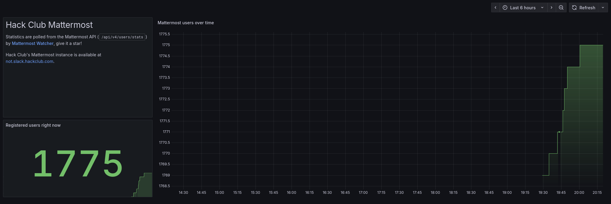

# Mattermost Watcher

Tracks the number of members of Hack Club's Mattermost instance (<https://not.slack.hackclub.com>), exporting it as a Prometheus metric.

## Online demo

View the dashboard on the interweb: 📊 <https://grafana.slevel.xyz/public-dashboards/445e1f759abf4612a92fdab3f5e82453>

[](https://grafana.slevel.xyz/public-dashboards/445e1f759abf4612a92fdab3f5e82453)

## Local development

This project uses Python (3.9+) and [uv](https://docs.astral.sh/uv/) for development.

1. Clone the repo
2. Run the tool, authenticating with some Mattermost account details (any user will do):

   ```bash
   uv run main.py --username USERNAME --password PASSWORD
   ```

3. Head to <http://localhost:9060/metrics> to see the metrics

### Using token authentication

Alternatively, you can authenticate using a [personal access token](https://docs.mattermost.com/developer/personal-access-tokens.html) (PAT). Note that normal users currently cannot create PATs on the Hack Club Mattermost.

```bash
uv run main.py --token YOUR_TOKEN
```

### Other options

For the full list of command-line options, run:

```bash
uv run main.py --help
```

## Production deployment with Docker Compose

1. Download the example Compose file from [deployment/docker-compose.yml](deployment/docker-compose.yml).
2. Edit the file to include your Mattermost authentication details
3. Start it with `docker compose up -d`
4. Metrics should now be available at <http://localhost:9060/metrics>

### Example `prometheus.yml` config

Start tracking the metrics by adding Daydream Watcher as a scrape config to a Prometheus-compatible database (e.g. Prometheus, VictoriaMetrics).

```yaml
scrape_configs:
  - job_name: mattermost-watcher
    scrape_interval: "10s"
    static_configs:
      - targets: ["mattermost-watcher:9060"]
```

<!-- ### Example Grafana dashboard

Start visualising the metrics by importing the example Grafana dashboard at [deployment/grafana-dashboard.json](deployment/grafana-dashboard.json) into your Grafana instance. -->

## Maintainers: Releasing a new version

First, check [existing tags published to Docker Hub](https://hub.docker.com/r/mmk21/mattermost-watcher/tags) and decide what kind of version bump to make.

Then, use the `release-new-version.sh` shell script, e.g.

```bash
./release-new-version.sh 0.2.1
```

It will

1. Bump the version in `pyproject.toml`
2. Create and push a Git tag for the new version
3. Build and publish the Docker image to Docker Hub

Then, manually check that the version bump commit is as expected, and `git push` it.
